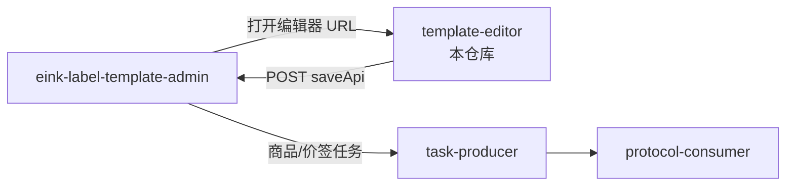

# E-Ink Label Template Editor

`eink-label-template-editor` 是电子价签模板可视化编辑器。它提供固定尺寸电子墨水屏画布、组件拖拽、动态字段绑定、电子墨水预览、模板保存 payload 生成和本地 OCR 智能导入能力。

本仓库只负责前端编辑体验。模板持久化、业务数据、权限、真实下发由 `eink-label-template-admin`、`esl-panpan-task-producer` 和 `esl-panpan-protocol-consumer` 承担。

## 职责边界

本项目负责：

- 基于屏幕 profile 创建固定尺寸画布。
- 编辑文本、矩形、线条、图片、价格、折扣、二维码、条形码等组件。
- 将组件绑定到商品动态字段。
- 按电子墨水屏色板预览渲染效果。
- 生成模板保存 payload。
- 支持通过 URL 参数或全局变量被后台系统嵌入。
- 支持本地 OCR 服务进行价签图片智能导入。

本项目不负责：

- 用户登录和权限。
- 模板数据库。
- 商品、门店、AP、价签管理。
- RabbitMQ、MQTT、AP/ESL 协议下发。

## 系统位置



## 技术栈

| 分类 | 技术 |
| --- | --- |
| Framework | Vue 3, TypeScript |
| State | Pinia |
| Canvas | Fabric.js |
| Build | Vite |
| i18n | vue-i18n |
| QR/Barcode | `qrcode`, CODE128 support |
| Font | Noto Sans SC Variable |
| Test | Vitest, Node.js test runner, jsdom |
| OCR | Local Python service, PaddleOCR model assets |

## 快速启动

```bash
cd /path/to/eink-label-template-editor
npm install
npm run dev -- --host 127.0.0.1 --port 5173
```

浏览器打开：

```plain
http://127.0.0.1:5173/editor
```

如果端口被占用，可以使用：

```bash
npm run dev -- --host 127.0.0.1 --port 4173
```

然后在 admin 中配置：

```bash
TEMPLATE_EDITOR_BASE_URL=http://127.0.0.1:4173/
```

## 核心功能

| 功能 | 说明 |
| --- | --- |
| 固定尺寸画布 | 使用 profile 的 width/height 初始化，适配不同价签型号 |
| 色彩模式 | 支持 `BW`、`BWR`、`BWRY`、`E6` |
| 电子墨水预览 | 将画布结果量化到目标色板 |
| 动态字段 | 支持商品名、价格、折扣、描述、图片、二维码、条形码、自定义字段 |
| 模板保存 | 生成 editable JSON、静态 PNG、动态元数据 |
| 多语言/市场 | 支持中文、英文、德语、法语、西语、俄语和市场格式 |
| 智能导入 | 支持本地 OCR 识别价签图片并生成初始模板 |
| 后台嵌入 | 支持 URL init 参数、URL query 参数和 `saveApi` |

## 组件类型

| 组件 | 类型 | 是否动态 | 典型绑定字段 |
| --- | --- | --- | --- |
| 矩形 | `RECT` | 否 | 无 |
| 线条 | `LINE` | 否 | 无 |
| 文本 | `TEXT` | 是 | `productName`, `description`, custom |
| 图片 | `IMAGE` | 是 | `imageUrl` |
| 价格 | `PRICE` | 是 | `price` |
| 折扣 | `DISCOUNT` | 是 | `discount` |
| 二维码 | `QRCODE` | 是 | `qrContent` |
| 条形码 | `BARCODE` | 是 | `barcodeContent` |

## 色彩模式

| 模式 | 颜色 |
| --- | --- |
| `BW` | 黑、白 |
| `BWR` | 黑、白、红 |
| `BWRY` | 黑、白、红、黄 |
| `E6` | 黑、白、红、绿、蓝、黄、橙 |

颜色选择和导出元数据会约束到当前 profile 的 palette。

## 与后台集成

### 方式一：后台 URL 参数

`eink-label-template-admin` 打开编辑器时会传入：

- `templateId`
- `templateName`
- `width`
- `height`
- `colorMode`
- `locale`
- `market`
- `apiBase`
- `saveApi`

编辑器会根据这些参数进入 create/edit 模式，并在保存时 POST 到 `saveApi`。

### 方式二：`?init=<base64-json>`

可以把完整初始化配置编码为 Base64 JSON：

```bash
node - <<'NODE'
const payload = {
  mode: 'create',
  profile: {
    profileId: 'profile_296_128_bwr',
    name: '2.9 inch BWR',
    width: 296,
    height: 128,
    colorMode: 'BWR',
    palette: [
      { name: 'white', value: '#FFFFFF' },
      { name: 'black', value: '#000000' },
      { name: 'red', value: '#CC0000' }
    ]
  },
  previewData: {
    productName: '脉动 维生素饮料',
    price: 10.8,
    discount: 8.8,
    description: '600ML',
    qrContent: 'esl.wdyc.cn',
    barcodeContent: '6902538004045'
  },
  saveApi: '/api/template/save'
};

const init = Buffer.from(JSON.stringify(payload), 'utf8').toString('base64');
console.log(`http://127.0.0.1:5173/editor?init=${encodeURIComponent(init)}`);
NODE
```

### 方式三：`window.__ESL_EDITOR_INIT__`

如果编辑器被嵌入到宿主页面，可以通过全局变量注入：

```ts
window.__ESL_EDITOR_INIT__ = {
  mode: 'create',
  profile,
  previewData,
  async onSave(payload) {
    console.log('save template', payload);
  }
};
```

如果同时提供 `onSave` 和 `saveApi`，`onSave` 优先。

## 保存 payload

保存时输出结构大致为：

```json
{
  "templateId": "tpl_xxx",
  "templateName": "PRICEPROMO",
  "profile": {
    "width": 800,
    "height": 480,
    "colorMode": "BWR",
    "palette": []
  },
  "fullJson": {},
  "staticDynamic": {
    "staticImage": {
      "type": "base64",
      "format": "png",
      "data": "data:image/png;base64,..."
    },
    "dynamicMetadata": {
      "fontFamily": "Noto Sans SC Variable",
      "reservedFields": [
        "productName",
        "price",
        "discount",
        "description",
        "imageUrl",
        "qrContent",
        "barcodeContent"
      ],
      "widgets": []
    }
  }
}
```

后台保存后，`deviceTemplateCode` 可作为 protocol-consumer 中 `wtag.tmpl` 的模板编码。

## 本地 OCR 智能导入

OCR 是可选能力。普通模板编辑和后台联动不依赖 OCR。

准备 Python 环境：

```bash
python3 -m venv .venv-ocr
source .venv-ocr/bin/activate
pip install -r scripts/ocr-service/requirements.txt
```

安装模型：

```bash
npm run ocr:install-models
```

启动本地 OCR 服务：

```bash
npm run ocr:local
```

模型目录：

```plain
runtime/ocr-models/
```

如果模型文件由 Git LFS 管理，也可以执行：

```bash
git lfs pull
```

Vite 默认会把 `/ocr/*` 代理到：

```plain
http://localhost:8000
```

可通过环境变量覆盖：

```bash
VITE_OCR_API_TARGET=http://127.0.0.1:8000 npm run dev
```

## 开发命令

| 命令 | 说明 |
| --- | --- |
| `npm run dev` | 启动 Vite 开发服务 |
| `npm run build` | TypeScript 检查并构建生产包 |
| `npm run preview` | 预览生产构建 |
| `npm run test` | 运行 Vitest 测试 |
| `npm run test:node` | 运行 Node.js 业务验证测试 |
| `npm run test:watch` | watch 模式测试 |
| `npm run ocr:install-models` | 安装/检查 OCR 模型 |
| `npm run ocr:local` | 启动本地 OCR 服务 |

## 测试

```bash
npm run build
npm run test
npm run test:node
```

测试覆盖：

- 初始化参数解析。
- 画布尺寸和 profile。
- 色彩模式。
- 字段绑定。
- 基础组件。
- 价格、折扣、二维码、条形码。
- 电子墨水预览。
- 保存 payload。
- `onSave` 和 `saveApi`。
- 端到端编辑流程。

## 常见问题

### admin 打开的编辑器地址不对

检查 admin 的：

```bash
TEMPLATE_EDITOR_BASE_URL
TEMPLATE_EDITOR_API_BASE_URL
TEMPLATE_EDITOR_SAVE_API_URL
```

如果 editor 跑在 `4173`：

```bash
TEMPLATE_EDITOR_BASE_URL=http://127.0.0.1:4173/
```

### 保存时报“未提供 onSave 回调或 saveApi”

说明初始化配置里没有保存出口。通过 admin 打开时应确保 URL 中包含 `saveApi`；嵌入宿主页面时应提供 `onSave` 或 `saveApi`。

### OCR 返回 502 或 503

- `502` 通常表示本地 OCR 服务未启动。
- `503` 通常表示模型文件缺失或仍是 Git LFS 指针文件。

处理：

```bash
npm run ocr:install-models
npm run ocr:local
```

### 生成模板在真实价签上显示不好

先检查：

- 画布尺寸是否与设备型号一致。
- 色彩模式是否与设备一致。
- 动态字段是否与后台商品数据一致。
- 价格、二维码、条形码是否在目标分辨率下可读。

## 开发约定

- 编辑器只输出模板和保存 payload，不直接接入 RabbitMQ/MQTT。
- 新增组件必须同步更新 save payload、动态元数据和测试。
- 变更 URL 初始化参数时，必须同步 admin 的 `TemplateEditorLinkService`。
- OCR 能力必须保持可选，不能影响普通编辑器启动。
